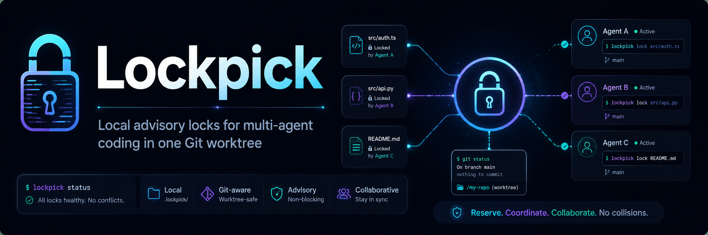

# Lockpick

Local advisory locks for multi-agent coding in one Git worktree.

<p align="center">
  
</p>


Lockpick is an agent-native coordination tool for shared coding worktrees.

- Detects the active agent and records lock ownership under its agent id.
- Reserves exact files, refreshes short leases, and recovers stale locks when safe.
- Serializes `git add` and `git commit` with a synthetic `@git/index` lock.
- Works with Codex and Claude Code, including subagents.

State is just files under `.lockpick/locks`: no daemon, database, hosted service, or
repository-specific prompt behavior.

## Setup And Usage

Lockpick is meant to be installed once as a global CLI, then run as `lockpick` inside the
repositories you want to coordinate. Bun `>=1.2` must be available at runtime.

```bash
bun install -g @simke9445/lockpick
lockpick --help
```

If you prefer npm for global packages:

```bash
npm install -g @simke9445/lockpick
lockpick --help
```

If the command is not found, add your package manager's global binary directory to `PATH`.

Inside Codex or Claude Code, use the global command from any host repository. The harness supplies
the agent identity; do not set an agent id yourself for normal use.

```bash
cd ../your-repo
lockpick init --check --json || true
lockpick init

lockpick identify --json
file_lock="$(lockpick acquire README.md --reason "edit README" --id-only)"
lockpick status --json
lockpick release "$file_lock" --id-only
```

`init` writes the host-repo support files. `acquire`, `status`, and `release` prove the core
lock loop without depending on the Lockpick checkout path.

## TL;DR

Concurrent repository work usually fails in three places: two workers edit the same file, a stale
"I am working on this" note never expires, or someone stages a shared Git index while another
worker is preparing a commit. Lockpick makes those coordination points explicit and scriptable.

| Need | Lockpick behavior | Proof surface |
| --- | --- | --- |
| Reserve files before editing | `acquire`, `expand`, `refresh`, `release` over repo-relative paths and globs | `lockpick capabilities --json` |
| Avoid shared Git-index races | `git begin` acquires `@git/index`; `git end` releases it and can release file locks | `src/locks/types.ts`, `tests/locks.test.ts` |
| Recover stale local locks | TTLs, liveness classification, `prune --dry-run`, then `prune` | `lockpick prune --dry-run --json` |
| Keep automation parseable | `--json`, `--id-only`, compact error payloads, documented exit codes | `tests/cli.test.ts` |
| Init repo guidance | Marked block in `AGENTS.md` by default, or `CLAUDE.md` with `--harness claude-code` | `lockpick init --check --json` |
| Audit health | `doctor --json` checks config, lock dirs, mutex state, and init drift | `lockpick doctor --json` |

Lockpick is advisory. It coordinates agents that agree to use it; it does not stop an editor, shell
command, or Git operation that ignores the protocol.

## Quick Demo

This demo is meant to run inside Codex or Claude Code. The active harness identity is detected
automatically, including Claude Code subagents when `lockpick init --harness claude-code` has
installed the project hook.

```bash
HOST="$(mktemp -d)"
cd "$HOST"
git init -q

printf 'console.log("hello")\n' > app.ts
printf '# Demo host repo\n' > AGENTS.md
printf '{"scripts":{}}\n' > package.json

# Expected to exit 1 when init drift is found; it does not write files.
lockpick init --check --json || true
lockpick init

lockpick identify --json
file_lock="$(lockpick acquire app.ts --reason "edit app" --id-only)"
lockpick expand --lock "$file_lock" README.md --id-only
lockpick refresh "$file_lock" --id-only

git_lock="$(lockpick git begin --refresh-lock "$file_lock" --reason "commit demo" --id-only)"
lockpick status --json
lockpick git end "$git_lock" --release-lock "$file_lock" --id-only

lockpick prune --dry-run --json
lockpick doctor --json
```

Expected shape:

```text
identify shows a harness source such as CODEX_THREAD_ID or LOCKPICK_HARNESS_AGENT_ID.
status shows two locks while the file lock and @git/index lock are held.
git end prints the released git lock id and file lock id.
prune --dry-run reports pruned_count 0 in a fresh repo.
doctor reports ok true after init completes.
```

## Why Lockpick

| Approach | Works well for | Where it falls short for shared worktrees |
| --- | --- | --- |
| Manual notes in chat or issues | Informal coordination and intent | No lease, no owner check, no parseable status, easy to forget before staging |
| Shell scripts | Local conventions around one repo | Usually miss conflict semantics, stale sessions, JSON contracts, and Git-index locking |
| `flock` | Process-level critical sections on one machine | Not a repo resource registry; no path/glob inventory, owner metadata, install guidance, or agent docs |
| Git hooks | Commit-time policy checks | Too late to prevent overlapping edits; hooks do not coordinate `git add` across workers |
| Hosted lock service | Cross-machine coordination | Requires a service, credentials, network access, and operational ownership |
| Lockpick | Local agents in one repository worktree | Advisory only; participants must opt in and use the commands |

## Install Details

Lockpick is a Bun/TypeScript CLI. Bun `>=1.2` is required even when the package is installed through
npm, because the executable uses `#!/usr/bin/env bun`.

### Global Install

```bash
bun install -g @simke9445/lockpick
lockpick --help
```

```bash
npm install -g @simke9445/lockpick
lockpick --help
```

Use one global install method, not both. After installation, run `lockpick init` from each host
repository that should use advisory locking.

### Host Init Behavior

`lockpick init` is idempotent. It can create or update:

| Path | Behavior |
| --- | --- |
| `.lockpick/locks/active/` | Local active lock records |
| `lockpick.config.ts` | Default config when missing; existing config is preserved |
| `AGENTS.md` | Marked Lockpick instructions block by default |
| `CLAUDE.md` | Marked instructions block when `--harness claude-code` is used |
| `.claude/settings.json` | Adds a Claude Code `PreToolUse` hook when `--harness claude-code` is used |
| `.claude/hooks/lockpick-agent-env.mjs` | Per-Bash-call agent id hook for Claude Code subagents |
| `.gitignore` | Adds `.lockpick/` |
| `package.json` | Adds missing recommended scripts when a package file exists |

Recommended host scripts inserted when absent:

```json
{
  "scripts": {
    "lockpick": "lockpick",
    "lockpick:status": "lockpick status",
    "lockpick:init": "lockpick init"
  }
}
```

## Quick Start

The examples in this section assume the global install from [Setup And Usage](#setup-and-usage)
and a supported agent harness. Codex and Claude Code identity is automatic.

1. Pick the instruction target.

   ```bash
   lockpick init --check --json || true
   lockpick init

   # Or target CLAUDE.md instead of AGENTS.md.
   lockpick init --check --harness claude-code --json || true
   lockpick init --harness claude-code
   ```

2. Inspect the detected agent id.

   ```bash
   lockpick identify --json
   ```

3. Acquire the narrowest lock before editing.

   ```bash
   lockpick acquire src/index.ts tests/cli.test.ts --reason "change CLI dispatch" --id-only
   ```

4. Expand before touching another file.

   ```bash
   lockpick expand --lock <lock_id> src/config.ts --id-only
   ```

5. Refresh before long edit batches, after tests, and before staging.

   ```bash
   lockpick refresh <lock_id> --id-only
   ```

6. Coordinate the shared Git index.

   ```bash
   git_lock="$(lockpick git begin --refresh-lock <lock_id> --reason "commit Lockpick change" --id-only)"
   git add <locked_paths>
   git commit
   lockpick git end "$git_lock" --release-lock <lock_id> --id-only
   ```

## Command Reference

`lockpick capabilities --json` is the source of truth for command metadata, flags, exit codes,
default TTLs, agent identity detection, and next commands.

| Command | Purpose | Key flags | Output notes |
| --- | --- | --- | --- |
| `acquire [paths...]` | Acquire locks for exact repo-relative paths or globs | `--glob`, `--reason`, `--ttl-ms`, `--agent-id`, `--json`, `--id-only`, `--verbose` | `--reason` and at least one path or glob are required |
| `expand --lock <id> [paths...]` | Add paths or globs to an existing lock atomically | `--lock`, `--glob`, `--ttl-ms`, `--agent-id`, `--json`, `--id-only`, `--verbose` | Requires the owning agent id |
| `refresh [locks...]` | Extend held lock leases | `--lock`, `--ttl-ms`, `--agent-id`, `--json`, `--id-only`, `--verbose` | Positional ids and repeatable `--lock` are merged |
| `release [locks...]` | Release held locks | `--lock`, `--agent-id`, `--json`, `--id-only`, `--verbose` | Requires the owning agent id |
| `status [paths...]` | List active locks, optionally filtered by resources | `--glob`, `--json`, `--id-only`, `--verbose` | `--id-only` prints active matching lock ids |
| `prune` | Remove reclaimable expired locks | `--dry-run`, `--json`, `--id-only`, `--verbose` | Use `--dry-run` before deleting |
| `identify` | Show detected agent identity | `--agent-id`, `--json`, `--verbose` | `--id-only` is rejected; use `identify --json` |
| `git begin` | Acquire the synthetic `@git/index` lock | `--reason`, `--refresh-lock`, `--ttl-ms`, `--agent-id`, `--json`, `--id-only`, `--verbose` | Can refresh held file locks first |
| `git end [locks...]` | Release the synthetic Git-index lock | `--lock`, `--release-lock`, `--agent-id`, `--json`, `--id-only`, `--verbose` | Can release file locks after the Git lock |
| `init` | Initialize or check host support files | `--check`, `--harness auto\|codex\|claude-code`, `--json`, `--verbose` | `--check` exits 1 when changes are needed and writes nothing |
| `capabilities` | Print the CLI contract | `--json` | Compact single-line JSON |
| `robot-docs guide` | Print an in-tool agent workflow guide | none | Human text, deterministic golden-tested output |
| `doctor` | Run read-only health checks | `--json`, `--verbose` | Exits 1 when warnings or errors are present |

Do not pass `--agent-id` in normal Codex or Claude Code use. That flag exists for unsupported
harness integrations and recovery from outside the original harness agent.

### Exit Codes

| Code | Name | Meaning |
| --- | --- | --- |
| 0 | `success` | Command completed successfully |
| 1 | `cli_or_check_error` | CLI parse error, init check drift, or `doctor` warning/error result |
| 2 | `lock_usage_error` | Invalid lock input, missing lock id, or missing lock resource |
| 3 | `lock_conflict` | Lock conflict or ownership failure |

When `--json` is present, parse and runtime errors use compact payloads shaped like:

```json
{"ok":false,"code":"commander.unknownOption","message":"error: unknown option '--jason'","details":{"suggestion":{"replace":"--jason","with":"--json","command":"lockpick status --json"}}}
```

## Configuration

Host repositories may add `lockpick.config.ts` at the repository root. Defaults stay generic.

```ts
import type { LockpickConfig } from "@simke9445/lockpick";

export default {
  // Display name used in generated instruction text. Defaults to the repo directory name.
  projectName: "example",

  // Local lock state root. Active records live under active/, events under events.jsonl,
  // and registry serialization uses a .mutex directory.
  lockRoot: ".lockpick/locks",

  command: {
    // Command rendered into generated AGENTS.md or CLAUDE.md instructions.
    executable: "lockpick",

    // Use prefix instead when the command should render through a project script or wrapper.
    // prefix: ["env", "LOCKPICK_PROFILE=team"],

    // Or render through a package script.
    // packageRunner: "bun",
    // packageScript: "lockpick",
  },

  defaults: {
    // Default lease length for new locks and refreshes.
    ttlMs: 600_000,

    // Upper bound accepted by --ttl-ms.
    maxTtlMs: 1_800_000,

    // Extra grace after expiry when liveness cannot be proven.
    unknownLivenessGraceMs: 600_000,
  },

  owner: {
    // Fallback lookup for unsupported harness integrations.
    // Codex and Claude Code use harness detection automatically.
    envKeys: ["LOCKPICK_AGENT_ID"],

    // Runtime harnesses checked first.
    harnesses: ["codex", "claude-code"],

    // Generic fallback prefix when no harness, explicit id, or env id is available.
    fallbackPrefix: "lockpick",
  },

  liveness: {
    // "unknown" is generic and local. "codex" checks Codex session metadata when configured.
    adapter: "unknown",
  },

  agents: {
    enabled: true,
    heading: "Lockpick coordination",
  },

  init: {
    updateAgents: true,
    updateGitignore: true,
    updatePackageScripts: true,
  },
} satisfies LockpickConfig;
```

Config discovery starts at the current working directory, walks up to the nearest `.git`, then
loads `lockpick.config.ts` if present. Without a config file, Lockpick uses the defaults above.

## Library API

The package export is defined in `package.json` as `src/index.ts`. In Bun/TypeScript projects, use
the package directly:

```ts
import {
  FileLockRegistry,
  defineLockpickConfig,
  executeLockCommand,
  loadLockpickConfig,
  runInit,
} from "@simke9445/lockpick";

const config = defineLockpickConfig({
  lockRoot: ".lockpick/locks",
});

await runInit({ root: process.cwd(), check: true });

const result = await executeLockCommand({
  name: "acquire",
  paths: ["src/index.ts"],
  globs: [],
  reason: "edit library entry",
  ttlMs: null,
  agentId: "docs-example",
  json: true,
  idOnly: false,
});

console.log(result.exitCode, result.json);

const registry = new FileLockRegistry({ cwd: process.cwd() });
console.log(registry.identify("docs-example").owner?.agentId);

await loadLockpickConfig();
console.log(config.lockRoot);
```

Other exported helpers include config resolution, init rendering, resource matching, resource
normalization, session detection, liveness probes, lock result rendering, and lock types.

## Architecture

```text
bin/lockpick.ts
  -> src/index.ts
    -> cli/main
      -> Commander parser
        -> lock command handlers
          -> loadLockpickConfig
          -> FileLockRegistry
            -> normalize paths/globs/@git/index
            -> .lockpick/locks/.mutex
            -> .lockpick/locks/active/<lock_id>.json
            -> .lockpick/locks/events.jsonl
        -> init handler
          -> lockpick.config.ts
          -> AGENTS.md or CLAUDE.md marked block
          -> .gitignore
          -> package.json scripts
        -> capabilities / robot-docs / doctor
          -> stdout text or compact JSON
```

The registry writes lock records atomically through a temporary file and rename. Mutating registry
operations are serialized with a directory mutex that Lockpick can reclaim after it becomes stale.

## Safety Model

Lockpick is built for cooperative local coordination.

| Guarantee | Details |
| --- | --- |
| Advisory locking | Lockpick reports and records conflicts; it does not patch editors, shells, or Git to enforce them |
| Owner-only changes | `expand`, `refresh`, and `release` require the agent id recorded on the lock |
| Short leases | Default TTL is 10 minutes; maximum default is 30 minutes |
| Stale recovery | Expired locks are classified by liveness and become reclaimable after the configured unknown-liveness grace |
| Safe inspection | `init --check --json`, `prune --dry-run --json`, `status --json`, `capabilities --json`, and `doctor --json` are the inspection surfaces |
| Git-index coordination | `git begin` locks only the synthetic `@git/index` resource; file locks are separate and should still cover staged paths |

Lockpick does not provide a hosted coordinator, cross-machine consensus, authentication, encryption,
or a migration layer for old lock schemas. The lock record schema is current-version only.

## Troubleshooting

| Symptom | Meaning | Next command |
| --- | --- | --- |
| `lock conflict: <path>` | Another active or unreclaimable lock overlaps your requested resource | `lockpick status <path> --json` |
| Conflict JSON has `suggested_action: "prune_then_retry"` | All overlapping locks are reclaimable | `lockpick prune --dry-run --json`, then `lockpick prune` |
| `Lock <id> is owned by <owner>; current owner is <caller>.` | The current agent id differs from the id that created the lock | Continue from the same harness agent, or use `--agent-id <owner>` for unsupported harness recovery |
| `At least one lock id is required for refresh.` | `refresh`, `release`, or `git end` needs a lock id | `lockpick status --id-only` |
| `Lock path must be repo-relative` | Absolute paths are rejected | `lockpick acquire path/from/repo/root --reason "<intent>"` |
| `Lock TTL must be <= 1800000.` | The requested lease exceeds the configured maximum | `lockpick refresh <lock_id> --ttl-ms 600000` |
| `init --check --json` exits 1 | Init drift was found; no files were written | Review JSON changes, then run `lockpick init` |
| `doctor --json` reports init drift | Support files are missing or stale | `lockpick init --check --json` |
| Unknown flag or command prints `next:` | Lockpick found a close match | Run the exact `next:` command |

## Limitations

- Lockpick is pre-release, and the CLI requires Bun at runtime.
- There is no checked-in GitHub Actions workflow, so this README does not show a CI badge.
- Lockpick coordinates one local worktree through files under `.lockpick/locks`; it is not a
  networked lock server.
- Advisory locks work only when participants use Lockpick before editing and staging.
- Liveness defaults to `unknown`; the Codex adapter is opt-in config, not a generic default.
- `init` writes a generic instruction block. It does not add prompt-optimization behavior,
  repository-specific defaults, or command aliases.
- There are no compatibility layers, deprecated command names, or migration tools for previous
  internal layouts or schemas.
- `lockpick --version` is not implemented; use `lockpick capabilities --json` for the current
  package version.

## FAQ

### Is this only for agents?

Lockpick is agent-native. A person can run the same commands for recovery or local debugging, but
the normal workflow assumes Codex, Claude Code, or another coding harness supplies a stable agent
id.

### How should agents identify themselves?

They normally should not. Lockpick checks supported harness identity first. Claude Code hooks pass
`LOCKPICK_HARNESS_AGENT_ID`; Codex uses `CODEX_THREAD_ID`; Claude Code falls back to
`CLAUDE_CODE_SESSION_ID` when the hook is absent. `--agent-id` and `LOCKPICK_AGENT_ID` are only for
unsupported harness integrations or recovery from outside the original harness agent. Without any
stable source, Lockpick falls back to a process-scoped id.

### What happens in CI?

Use `lockpick status --json`, `lockpick capabilities --json`, and `lockpick doctor --json` for
read-only checks. Mutating lock commands can work in CI, but Lockpick is primarily designed for
interactive shared worktrees.

### Does Lockpick replace Git branches?

No. It coordinates local edits and shared index access inside a worktree. Branch strategy stays
outside Lockpick.

### Does `@git/index` lock every file?

No. `@git/index` only coordinates staging and commit access. Acquire normal file or glob locks for
the paths you intend to edit and stage.

### How does stale lock cleanup work?

Locks expire by TTL. If liveness is dead, or unknown beyond the configured grace period, `prune`
can remove the record. Use `prune --dry-run --json` first.

### Can I use it in a monorepo?

Yes, if every participant agrees on the same repository root and lock root. Use repo-relative paths
and configure `lockRoot` if the default `.lockpick/locks` is not where you want local state.

### Is the lock state safe to commit?

No. `init` adds `.lockpick/` to `.gitignore`. The lock state is local coordination data.

## Development

```bash
bun install --frozen-lockfile
bun test
bun run typecheck
bun run lint
bun run check
```

The current tests cover CLI parsing and rendering, file-backed lock semantics, config loading,
init idempotency, doctor output, capabilities JSON, generated instruction text, and the
golden-tested robot guide.

See [CONTRIBUTING.md](CONTRIBUTING.md) for contribution guidelines.

## License

MIT. See [LICENSE](LICENSE).
